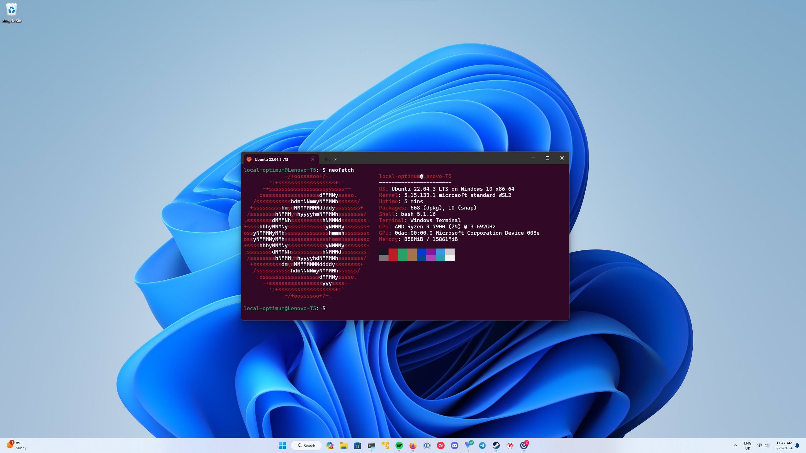

# Una solucion quiero...

Ayer estuve en un interesante taller sobre [MCP](#0) (*Model Control Protocol*). Muy interesante. Pero era un taller, ya sabes, de esos que te llevas el ordenador y vas haciendo las cosas según te las enseñan. Y claro, pasó lo de siempre. Lo de siempre es que, aunque los organizadores del taller se hayan preocupado muy mucho de informar por anticipado de lo que hay que llevar instalado y configurado, a la hora de la verdad, con un grupo de 8 o 10 personas, se dan mil problemas solo para instalarse lo necesario.

Y con un agravante: todos los ordenadores eran Windows. De los que muchas organizaciones entregan “listos para usar”, aprovechando la familiaridad de la interfaz gráfica y el ecosistema de herramientas empresariales. Y además se aseguran de que los usuarios no puedan "tocar demasiado".

Así que a los 10 minutos la mitad de los asistentes, además de exhibir sus conocimientos de juramentos en arameo, peroraba en alta voz sobre lo guay que sería trabajar con Linux en vez de con Windows.

Uno de los eternos debates.

¿Mi opinión? Bueno, no creo que tener máquinas Linux nos hubiera arreglado todos los problemas en este taller. Pero si pienso que Linux es de forma natural un entorno mejor para desarrollo software y hacer proyectos de Ciencia de Datos, Anaytics, Machine Learning, AI y todas esas zarandajas en las que nos enredamos durante nuestras jornadas laborales (y, muchas veces, extra-laborales...).

Así que pensé en escribir este artículo. Porque hay una solución. No es perfecta para los *linuxeros* talibanes, pero si solo tienes una máquina Windows con pocas posibilidades de personalización a tu gusto, te puede valer. Hablo de que es posible disfrutar de un entorno Linux (casi) completo sin abandonar Windows: con **WSL (Windows Subsystem for Linux)**.

# Lo que te voy a contar

Pues mira, lo fundamental será ir al grano: la receta para que configures tu entorno de trabajo con Linux bajo WSL en tu máquina Windows.

Permíteme solamente antes una pequeña introducción sobre WSL y porqué puede ayudarte a trabajar mejor en tus proyectos.

## WSL: y eso *¿quéh lo qué eh?*

WSL 2 (Windows Subsystem for Linux 2) es la segunda generación del subsistema que Microsoft introdujo para ejecutar entornos Linux directamente sobre Windows. A diferencia de la primera versión, que traducía llamadas al kernel Linux “al vuelo”, WSL 2 incluye un micro-kernel Linux real dentro de una pequeña máquina virtual optimizada. ¿Qué significa esto en la práctica?

-   **Arranque ultrarrápido**: abres tu terminal Bash en un par de segundos, sin esperar a que levante un SO completo.

-   **Compatibilidad casi total**: herramientas como `apt`, `docker`, `kubectl` o `ssh` funcionan tal cual en una distro Ubuntu, Debian o la que elijas.

-   **Integración de archivos**: tus proyectos en `C:\Users\…` son accesibles vía `/mnt/c/...`, y cualquier fichero que edites en VS Code (o tu IDE favorito) está disponible al instante desde la consola Linux.

Ahora bien, WSL 2 **no es un Linux 100 % puro**. ¿Por qué?

-   **Systemd**: hasta hace poco no venía activado de serie, así que algunos servicios necesitan “trucos” para arrancar de la forma tradicional.

-   **Drivers y hardware**: el micro-kernel gestiona GPU y red a través de Windows, por lo que, aunque tengas CUDA y accedas a tu GPU, no estás pasando por un kernel Linux nativo.

-   **Snapshots y backups**: no tienes herramientas nativas como LVM o ZFS, aunque sí puedes exportar/importar tu distro WSL fácilmente.

Aun con esas diferencias, en la práctica WSL 2 te da **el 95 % de la experiencia Linux** con una sencillez y ligereza propias de Windows.

## Pero ¿por qué va a mejorar tu vida?

Imagina poder ejecutar tus scripts de Python o R, orquestar contenedores Docker y desplegar tus pipelines de datos con los mismos comandos y versiones que hay en tus servidores de producción —sin abandonar tu portátil Windows ni pelearte con máquinas virtuales lentas. WSL 2 consigue justamente eso, y de forma transparente:

-   **Menos fricciones al instalar y aislar entornos**\
    Con `apt`, `conda` o `pyenv` montas entornos limpios en segundos, sin batallar con rutas o permisos de Windows. Cada proyecto queda bien separado, reproducible y fácil de compartir con compañeros que usen Linux nativo.

-   **Rendimiento y estabilidad**\
    Gracias al micro-kernel real, las operaciones de lectura/escritura de disco, los procesos en paralelo y el acceso a GPU funcionan casi tan rápido como en una distro instalada “a pelo”. Olvídate de la lentitud de las VMs tradicionales y de esos picos de CPU o I/O inesperados.

-   **Workflow homogéneo con tus herramientas favoritas**\
    Sigue usando VS Code, IntelliJ o cualquier IDE de Windows para editar, depurar y versionar tu código, mientras lo ejecutas en un Bash real. Tus scripts de despliegue con `kubectl`, `helm` o `aws` fluyen igual que en producción, y tienes acceso a Bash, `grep`, `awk` y toda la potencia del ecosistema Linux.

-   **Ahorro de tiempo y dolores de cabeza**\
    Despedirte de errores extraños en Windows (compilaciones fallidas, paquetes con dependencias C/C++ imposibles…) significa más tiempo creando valor y menos horas pegado al Google “how to pip install cvxpy on Windows”.

En resumen, puedo instalar (casi) lo que quiera y se simplifican mucho tareas que en Windows son casi imposibles (¿te has pegado alguna vez con cosas que requieran compilación en Windows, por ejemplo).

No solo aumentará tu productividad: también rebajará esa frustración que te reconcome cada vez que Windows hace de las suyas.

{fig-align="center"}

# Por fin: la receta para instalarte Ubuntu en Windows

No te voy a engañar. Lo que sigue a continuación no lo he escrito yo, sino ChatGPT. Así que las reclamaciones a Sam Altman.

Compréndelo, cuando configuré mi entorno no me dediqué durante una semana a estudiar cómo hacerlo , se lo pregunté a ChatGPT con un prompt currado y fue muy bien.

Al final del proceso le pedí que escribiera esta receta. A veces no tiene muy buena memoria, así que puede que falte algo, pero en general reconozco bastante bien el proceso. Y si algo no te funciona, ya sabes: le preguntas ;-)

La receta es para instalar Ubuntu, pero si quieres instalar la distro que prefieras, ya sabes: ChatGPT o similar (no, si al final nos vamos a quedar tontos con esto)

Sin más dimes y diretes, aquí va la receta:

## Ingredientes (Requisitos Previos)

-   **Sistema Operativo**

    -   Windows 10 (v2004 o superior) o Windows 11, 64 bits, con virtualización habilitada en BIOS.

-   **Hardware**

    -   CPU multinúcleo moderno.
    -   ≥ 8 GB RAM (recomendado ≥ 16 GB).
    -   Unidad SSD con al menos decenas de GB libres.

-   **Software en Windows**

    -   Visual Studio Code (última versión).
    -   Docker Desktop con integración WSL habilitada (esto solo si ya tienes Docker en Windows, para no tener que instalarlo en Ubuntu).

-   **Conexión a Internet**

    -   Para descargar paquetes, contenedores y dependencias.

------------------------------------------------------------------------

## Receta: Instalación y Configuración

### 1. Habilitar e instalar WSL 2 con Ubuntu

1.  Abre PowerShell **como Administrador** y ejecuta:

    ``` powershell
    wsl --install
    ```

    -   Esto habilita WSL y Virtual Machine Platform, e instala Ubuntu por defecto.

2.  (Opcional) Si quieres otra distro:

    ``` powershell
    wsl --list --online
    wsl --install -d <NombreDistro>
    ```

3.  Si no reinicia automáticamente, **reinicia** el equipo cuando te lo solicite.

### 2. Primer arranque de Ubuntu y actualización

1.  Desde el menú Inicio, abre **Ubuntu**.

2.  Actualiza repositorios e instala actualizaciones:

    ``` bash
    sudo apt update && sudo apt upgrade -y
    ```

### 3. Configurar VS Code con Remote-WSL

1.  En VS Code, instala la extensión **Remote – WSL**.

2.  Abre una ventana WSL:

    -   Pulsa `F1` → `Remote-WSL: New Window`.

3.  Dentro de esa ventana, instala en WSL las extensiones que necesites:

    -   Python, R, Docker, Quarto, etc.
    -   Selecciona “Install in WSL: Ubuntu” cuando VS Code lo pregunte.

### 4. Ajustes de Git para finales de línea LF

``` bash
git config --global core.autocrlf false
git config --global core.eol lf
git config --global core.safecrlf true
```

Y en tu proyecto añade un fichero `.gitattributes` con:

```         
* text=auto eol=lf
*.sh text eol=lf
*.py text eol=lf
*.R  text eol=lf
*.md text eol=lf
```

### 5. Instalación y gestión de versiones de Python

1.  Instala **pyenv**:

    ``` bash
    curl https://pyenv.run | bash
    ```

2.  Añade a tu `~/.bashrc`:

    ``` bash
    export PATH="$HOME/.pyenv/bin:$PATH"
    eval "$(pyenv init --path)"
    eval "$(pyenv virtualenv-init -)"
    ```

3.  Instala y usa Python 3.11.4 (o el que te dé la gana):

    ``` bash
    pyenv install 3.11.4
    pyenv global 3.11.4
    ```

4.  Instala `pipx` y `poetry`:

    ``` bash
    sudo apt install python3-pip pipx
    pipx ensurepath
    pipx install poetry
    ```

5.  Con `pipx`, añade herramientas CLI:

    ``` bash
    pipx install black isort flake8 mypy pre-commit jupyterlab dvc cookiecutter uv
    ```

### 6. Instalación de R y paquetes esenciales

1.  Activa repositorios:

    ``` bash
    sudo add-apt-repository universe
    sudo apt update
    sudo apt install r-base r-base-dev
    ```

2.  Instala dependencias del sistema:

    ``` bash
    sudo apt install -y libxml2-dev libcurl4-openssl-dev libssl-dev \
        libcairo2-dev libxt-dev libgtk2.0-dev build-essential
    ```

3.  Desde R, instala paquetes clave:

    ``` r
    install.packages(c("xml2","lintr","roxygen2","httpuv","languageserver"),
                     repos="https://cloud.r-project.org")
    install.packages("remotes")
    remotes::install_github("nx10/httpgd")
    ```

### 7. Instalar Quarto CLI y extensión

1.  Descarga e instala:

    ``` bash
    wget https://github.com/quarto-dev/quarto-cli/releases/download/v1.7.31/quarto-1.7.31-linux-amd64.deb
    sudo apt install ./quarto-1.7.31-linux-amd64.deb
    ```

2.  En VS Code (WSL), instala la extensión **Quarto**.

3.  Prueba un proyecto Quarto:

    ``` bash
    mkdir ~/quarto-ejemplo && cd ~/quarto-ejemplo
    quarto create-project .
    quarto render index.qmd
    ```

### 8. Configurar Docker en WSL

1.  Añade tu usuario al grupo `docker`:

    ``` bash
    sudo usermod -aG docker $USER
    newgrp docker
    ```

2.  Verifica el funcionamiento:

    ``` bash
    docker version
    docker run hello-world
    ```

3.  Instala en VS Code la extensión **Docker** (en la ventana Remote-WSL).

### 9. Flujo de trabajo básico

-   **Crear proyectos**

    -   Python: `poetry new mi_proyecto` → elige intérprete `.venv/bin/python`.
    -   R: en R console, `usethis::create_project("miRproyecto")`.

-   **Abrir proyectos**

    -   En VS Code Remote-WSL: `File > Open Folder > ~/projects/...`.
    -   Para carpetas de Windows: `File > Open Folder > /mnt/c/...`.

-   **Workspaces**

    -   `File > Add Folder to Workspace…`
    -   `File > Save Workspace As…` para crear un `.code-workspace`.

-   **Copiar proyectos**

    ``` bash
    cp -r /mnt/c/Users/... ~/projects/
    # O usando rsync, o directamente via \\wsl$\Explorer
    ```

### 10. GitFlow (opcional)

1.  Instala `git-flow`:

    ``` bash
    sudo apt update
    sudo apt install git-flow
    ```

2.  Inicialízalo en tu repo:

    ``` bash
    git flow init
    ```

    -   Acepta los valores por defecto (master/main, develop, prefixes…).

3.  Usa los comandos:

    ``` bash
    git flow feature start mi-feature
    git flow feature finish mi-feature
    # Igual para release, hotfix…
    ```

### 11. Verificaciones finales

-   Comprueba Git:

    ``` bash
    git config --list | grep core
    ```

-   Versiones:

    ``` bash
    python --version
    poetry --version
    pipx list
    ```

-   En R:

    ``` r
    library(languageserver)
    library(httpgd)
    ```

-   CLI:

    ``` bash
    quarto --version
    docker version
    ```

------------------------------------------------------------------------

¡Pues hala! Con esto tendrás un entorno completo en WSL2 + VS Code para tus proyectos de Data Science, Machine Learning e IA con Python y R.

¡A disfrutar!
