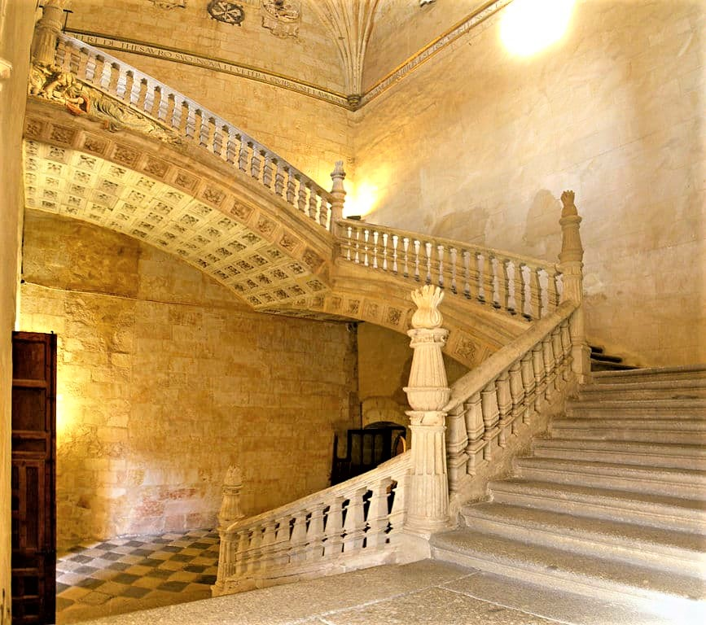
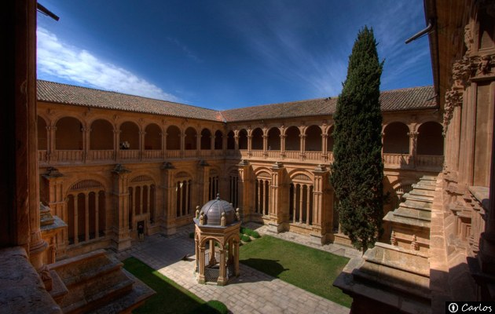
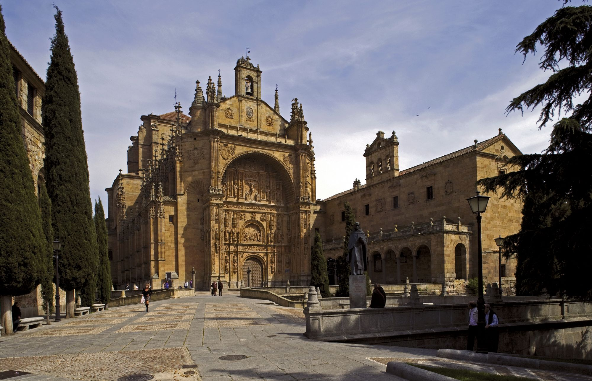

\- Vuestro artefacto no funciona. ¡Produce resultados insensatos! Según vuestra máquina, todos los cuerpos del Sistema Solar tienen la misma gravedad! ¡Y es del orden del de las estrellas!

La enfadada voz del dominico me hace volver a la realidad. Me había quedado embelesado admirando, desde el superior, los hermosos claustros de este convento, San Esteban, en la ciudad de Salamanca. La escalera que los une es un prodigio. La financió el mismo fraile que me abronca. Él mismo es, sin duda, un prodigio.

{fig-align="center"}

\- Fray Domingo, fray Domingo - intento tranquilizarlo - vayamos a un lugar más tranquilo y me lo cuenta todo, con pelos y señales.

\- ¿Con pelos y señales? Qué extraña manera de hablar la vuestra, lo había olvidado...

Recorremos en silencio el camino hasta la biblioteca del convento. En el trayecto rememoro cómo conocí a este fraile dominico, hoy ya un anciano de 60 años. Fue hace 10, en mi primera misión a estas coordenadas. Él acababa de publicar "Super octo libros Physicorum Aristotelis commentaria" y estaba preparando su siguiente obra sobre el tema: "Super octo libros physicorum Aristotelis quaestiones". En ellos se anticipaba ¡60 años! a Galileo en la descripción del movimiento de caída libre como uniformemente acelerado e introducía la noción de masa inerte o "resistencia interna" al movimiento, concepto fundamental en la futura mecánica newtoniana.

{fig-align="center"}

Si, fray Domingo de Soto era un genio. Un prodigio, he dicho antes, de los que entonces producía la Universidad de Salamanca. En su ficha decía:

------------------------------------------------------------------------

**MINISTERIO DEL TIEMPO**\
*Ficha de personaje histórico*

**NOMBRE:** Domingo de Soto\
**NACIMIENTO:** 1495, Segovia, España\
**FALLECIMIENTO:** 15 de noviembre de 1560, Salamanca, España\
**OCUPACIÓN:** Teólogo, filósofo, jurista y físico\
**AFILIACIONES:** Orden de los Dominicos, Universidad de Salamanca, confesor de Carlos I

**PERFIL:**\
Domingo de Soto fue una figura clave de la **Escuela de Salamanca**, cuyas contribuciones abarcaron la teología, la filosofía y la ciencia. Fue pionero en describir el **movimiento de caída libre uniformemente acelerado**, anticipándose a Galileo, e introdujo la noción de **masa inerte**, precursora de la mecánica newtoniana.

En el ámbito jurídico, contribuyó al desarrollo del **Ius Gentium**, sentando bases para el derecho internacional y defendiendo la dignidad de todos los pueblos. Su participación en la **Junta de Valladolid (1550-1551)** influyó en el debate sobre los derechos de los pueblos indígenas del Nuevo Mundo.

**APORTACIONES DESTACADAS**

-   **Física:** En *Super octo libros Physicorum Aristotelis commentaria* (1551), describió el movimiento de caída libre como acelerado de forma uniforme y formuló ideas precursoras de la mecánica clásica.

-   **Derecho:** En *De iustitia et iure* (1553), exploró la justicia desde la ley natural, influenciando el derecho moderno.

-   **Teología:** Comentó la *Summa Theologica* de Santo Tomás de Aquino, consolidando su prestigio como teólogo.

-   **Ética:** En *De ratione tegendi et detegendi secretum* (1541), reflexionó sobre el secreto y la ética de su revelación.

**INFLUENCIA POSTERIOR**

Las ideas de Soto han influido en la evolución del derecho internacional, la filosofía jurídica y la mecánica clásica. Su defensa del derecho de gentes ha sido considerada un antecedente del derecho moderno, y su visión sobre la física inspiró a pensadores como Galileo y Newton.

**CURIOSIDADES:**

-   Fue confesor personal de Carlos I y participó en el Concilio de Trento.

-   Sus aportaciones científicas fueron redescubiertas siglos después de su muerte.

-   La Escuela de Salamanca es considerada precursora del derecho internacional.

**MISIÓN DEL MINISTERIO:**\
Proteger su legado en la historia, asegurando que sus contribuciones a la física y el derecho permanezcan inalteradas.

------------------------------------------------------------------------

Y eso es lo que yo había venido hacer aquí: asegurarme de que "sus contribuciones" (en este caso, a la física) "permanezcan inalteradas". En otras palabras, impedir que este dominico descubra la mecánica newtoniana (con su teoría gravitatoria y todo) ¡más de un siglo antes que Newton!

Fray Domingo, como todos en su época, estaba estudiando fenómenos naturales a base de reunir datos y tratar de encontrar patrones. Un enfoque empírico. Todavía les costaba generalizar Leyes. Y mucho más lejos quedaba el método científico actual: primero la hipótesis; después las deducciones y predicciones; y, como "broche final", la corroboración o refutación a partir de datos experimentales.

Si no hacíamos algo, él acabaría dando, por sí solo, todos estos pasos. Y adiós a la Historia tal como la conocemos.

La estrategia que el Ministerio había diseñado para evitarlo era simple: confundirlo.

Y ahí entraba yo, un científico de datos con una oposición recién ganada en el Ministerio del Tiempo...

En mi primer viaje contacté con él en Trento, donde había sido destinado para participar en el famoso Concilio. A base de conversaciones de tipo científico me resultó fácil ganarme su confianza. Poco a poco empecé a hablarle de que "desde tierras lejanas, en Oriente, había llegado a mi poder un artefacto y unas tablas de datos sobre cuerpos celestes".

Fray Domingo, curioso como pocos y con ese espíritu incansable que le caracterizaba, no tardó en pedirme que le mostrara aquel misterioso artefacto. En la penumbra de su austero aposento en Trento, con las paredes cubiertas de libros y tratados, saqué de mi valija un pequeño dispositivo que, a sus ojos, debía parecer cosa de hechicería. Se trataba de una simple tableta electrónica camuflada bajo una cubierta de cuero envejecido, que le presenté como un "manuscrito mágico", capaz de realizar cálculos impensables para su tiempo.

—Decís que este objeto proviene de Oriente... —murmuró, acariciando con cautela la cubierta.

—Así es, maestro. De la lejana China, donde los sabios han acumulado siglos de conocimiento en las artes celestiales.

Sus ojos brillaron con la fascinación de quien está al borde de un gran descubrimiento. Y así, con estudiada teatralidad, le mostré las tablas de datos: masas, radios y valores de gravedad de estrellas que, por supuesto, eran absolutamente precisos...

—Ved aquí, fray Domingo. Estos números fueron obtenidos por métodos desconocidos, pero creedme, la precisión de estas mediciones es inigualable.

Soto repasó las cifras con la frente fruncida, como quien intuye un orden oculto.

—Asombroso... pero, decidme, ¿cuál es la relación exacta entre la masa y la gravedad de estos cuerpos?

Ahí estaba la clave. Si lograba sembrar en él la semilla de la duda, la confusión haría el resto. Me encogí de hombros con fingida humildad.

—No lo sé con certeza, maestro. Los sabios de Oriente afirman que han encontrado patrones, pero la fórmula exacta... aún permanece oculta.

—Hm... —murmuró, perdido en sus pensamientos—. Quizás haya una proporción oculta, algún principio divino que rija estas relaciones. Debemos estudiarlo más a fondo.

Al marcharme, dejé al fraile absorto en las complejidades del artefacto..

Y, justo antes de regresar a mi época, me aseguré de hacerle llegar una carta con una nueva tabla de datos, similar a la que ya tenía sobre estrellas, pero en esta ocasión sobre objetos del sistema solar.

------------------------------------------------------------------------

Llegamos finalmente a la biblioteca. Fray domingo me conduce a una sala anexa, pequeña, donde se ve que tiene su lugar de trabajo más íntimo, aunque bien iluminado

El fraile suspira profundamente y se vuelve hacia mi mesándose la barba con gesto de impaciencia. Sus ojos, vivaces e inquisitivos, me escrutan con severidad.

—Decidme, amigo extranjero —insiste—, ¿qué hechicería es esta que me habéis traído? ¿Cómo puede ser que vuestra máquina, que en otro tiempo juzgué milagrosa, me dé ahora desatinos por respuestas? ¿Pretendéis burlaros de mí?

Me apresuro a calmarle, esbozando una sonrisa conciliadora mientras caminamos por el claustro, donde la luz de la tarde se filtra suavemente entre los arcos góticos.

—Nada más lejos de mi intención, fray Domingo. Mas os aseguro que no hay ardid ni encantamiento en mi artefacto. Es la naturaleza misma del método que emplea la que os ha conducido a tan extraño desenlace.

Soto frunce el ceño y se detiene en seco.

—Explicaos, que no hallo sentido a vuestras palabras. ¿Cómo puede ser que una herramienta que antaño acertó con precisión, yerre ahora de modo tan grotesco?

Me apoyo en la baranda de piedra, contemplando los patios ajardinados, y respiro hondo antes de responder.

— Veréis, maestro —digo con tono sosegado—, la máquina no se equivoca… sencillamente **no sabe lo suficiente**.

Domingo de Soto entrecierra los ojos, evaluando mis palabras con la misma precisión con la que estudia sus manuscritos.

— ¿No sabe lo suficiente? —repite, casi con desdén—. Decidme, ¿es acaso la máquina una criatura que requiere más conocimiento para obrar con acierto?

Sonrío, porque sé que ya ha mordido el anzuelo.

— Exactamente, fray Domingo. Vuestra perspicacia no cesa de asombrarme. Esta máquina… no es como vos, que razonáis con elocuencia y rigor. Es más bien como un aprendiz que, con cada dato nuevo que recibe, aprende un poco más. Pero si le faltan elementos esenciales… bueno, ya veis lo que sucede.

— Entonces… —el fraile empieza a pasearse por la sala, cruzando las manos tras la espalda—, si los datos sobre los cuerpos del sistema solar producen tales desvaríos, ¿qué significa?

— Que hay **algo** que desconocemos —respondo en tono grave—, alguna propiedad que distingue a las estrellas de los planetas, algo que vuestra máquina no ha podido considerar.

Soto se detiene en seco, pensativo.

— Esto es… preocupante —murmura—. Siempre he supuesto que los astros obedecen a las mismas causas universales. Pero si vuestro artefacto, con su precisión oriental, yerra así... podría significar que la naturaleza de los cuerpos celestes no es tan uniforme como creíamos.

Asiento solemnemente.

— He aquí el dilema, maestro. Tal vez las estrellas posean una sustancia que no existe en los planetas, una esencia distinta que altera sus propiedades. Necesitamos más datos, más observaciones, más… comprensión.

Fray Domingo se acaricia la barba, su mente girando en círculos. Sé que está atrapado. **Lo he desviado justo lo suficiente**.

— Más datos... —murmura—. Claro, claro... Debemos estudiar más cuerpos celestes, comparar sus cualidades, sus esencias. Quizás la relación entre la masa y la gravedad dependa de algo más que el simple tamaño... quizá la densidad, la composición, la…

Levanta la mirada, encendida de entusiasmo.

— Amigo mío, debo pedir vuestra ayuda. ¡Necesito más información! ¿Podríais obtenerme nuevas tablas? Datos sobre cometas, lunas… incluso sobre los cuerpos errantes que algunos creen vagar en los cielos.

Fingiendo vacilación, asiento lentamente.

— Haré lo posible, fray Domingo, pero os advierto: estos datos son difíciles de obtener. Los sabios de Oriente tardan años en recopilarlos…

— ¡Os ruego que insistáis! —dice con apremio—. Mientras tanto, seguiré analizando los patrones con lo que tengo. Tal vez necesitemos una clasificación más minuciosa, más detallada.

Sonrío para mis adentros. **Objetivo cumplido**. Domingo de Soto acaba de embarcarse en una búsqueda interminable, convencido de que necesita más información antes de poder formular una teoría unificadora. Y apenas le quedan 5 años de vida.

Su genio quedará atrapado en la maraña de datos, incapaz de alcanzar la simple elegancia de la ley de la gravitación universal. Newton puede dormir tranquilo.

{fig-align="center"}

------------------------------------------------------------------------

¿Queréis conocer el "making of" de esta misión? Lo tenéis en el [siguiente artículo](/posts/fraile_maquina_agente_2/fraile_maquina_agente_2.qmd).
